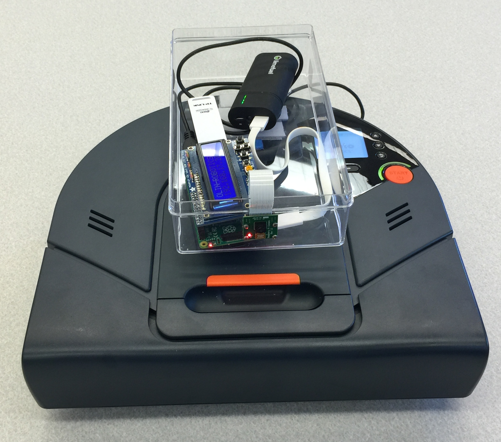

# ComputingResources
This is a list of resources that we use in the computing curriculum at Olin.  This repository is mainly meant to provide pointers to other resources.

## Quantitative Engineering Analysis Boat Modeling

Here are some tools that we use to introduce various mathematical and computational concepts needed to model the stability properties of a boat.  The students are tasked with fabricating a boat that meets various performance specs.  They must analyze the boat design before fabricating, avoiding trial and error solutions.

[MATLAB script for boat modeling](https://drive.google.com/open?id=15sFfvCS-eCwaSVjfIEiIkUwaZrH-8ofX)

## Software Design

Software Design is Olin's entrypoint into the computing curriculum.  It provides a broad set of skills useful for all engineers.  The course uses a series of themed mini projects to familiarize students with computational ideas and help them build the skills and confidence to take on a large, open-ended team project.  To get a better sense of the course in totality, consult the [2018 Spring Software Design class webpage](https://sd18spring.github.io/).

### Final Projects

A [comprehensive list of the Software Design final projects](https://docs.google.com/document/d/1WGZM_efUftsclgdkImfoBmJQ82VOvujQUa1dckPWPbA/edit) for the semesters that I've taught the class.

### Software Design Toolboxes

We use the concept of toolboxes to prepare students to pursue an open-ended, interdisciplinary 6-week group project.  We have created a [repository of toolboxes](https://toolboxes.olin.build/) for this purpose.

## Robots and Sensors as Services

In order to make the barrier to integrating sensing and robotic hardware into projects, I have created a number of packages that allow students to interface to these platforms wirelessly.  I use ROS (Robot Operating System) as a middleware platform, which allows students to write code in Python, C++, Java, or MATLAB.

* [ARKit ROS bridge](https://github.com/occamLab/ARKit-Ros-Bridge)
* [Google Tango ROS bridge](https://github.com/occamLab/tango_ros_bridge) (Tango has unfortunately been discontinued).  In the example below, we created a prototype app that allows someone who is blind to browse the food stations in the dining hall.  The animation shows my physical movement along with the corresponding sensor data as received, wirelessly by a laptop running ROS.  The visualization shown was created using the built-in ROS visualization tool RViz.

* [Wireless Neato connection instructions in Python](https://sites.google.com/site/comprobo18/how-to/setting-up-your-environment?authuser=0) [Wireless Neato connection instructions for MATLAB](https://docs.google.com/document/d/17ita7IdgjyPXozO6x2rHP4qAwJgT1e4B124CRmnSkfA/edit?usp=sharing) (Contact me at Paul.Ruvolo@olin.edu if you are interested in using this hardware platform.  I will share my platform which combines a Raspberry Pi and PiCam module to the commercially available Neato platform.  Total cost is about $350.)

## Technology, Accessibility, and Design

Technology, Accessibility, and Design (TAD) is a course that I co-developed with Caitrin Lynch, Professor of Anthropology.  It investigates these three main themes of technology, accessibility, and design from an interdisciplinary perspective.  The course uses a combination of reading and discussion, experiential activities, and a longterm design project that students engage in with a community partner who is blind or works with folks who are blind.  In the first iteration, several projects that had a substantial computational component emerged from the class.  I am including them here to showcase the various ways in which computing can appear within the design curriculum.

* [Web Accessibility Quick Check](http://waqc.herokuapp.com/)
* [Chef's Touch](https://github.com/arianaolson419/AccessibleCooking)

## Robotics

I teach a number of robotics classes.  [A Computational Introduction to Robotics](https://sites.google.com/site/comprobo18/home?authuser=0) is a full semester course that emphasizes the software engineering, algorithmic, and modeling decisions that go into programming modern robotic systems.

For Olin's integreated course Quantitative Engineering Analysis, I co-developed two robotics modules.  The first, Robo Ninja Warrior, uses mobile robotics as a way to teach physics, math, and computational concepts (with a particular emphasis on optimization).  The second, Rocky the Inverted Pendulum Robot provides a deep dive into modeling and controls with the goal of getting a Segway-like robot to perform various tasks.  Both of these modules are not available in a public repository; however, I am willing (and excited) to share them.  Please reach out to me if you'd like to use or learn more about these materials.
