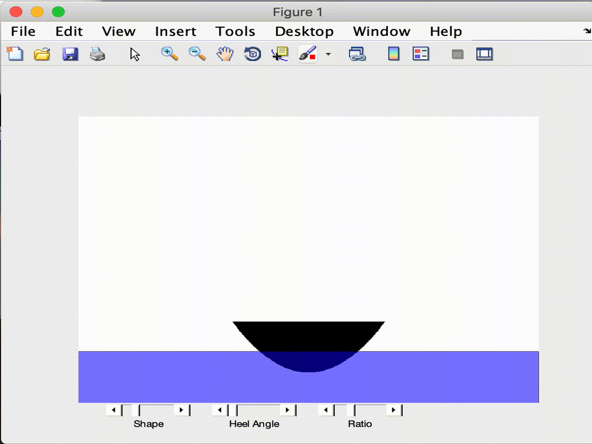

# ComputingResources
This is a list of resources that we use in the computing curriculum at Olin.  This repository is mainly meant to provide pointers to other resources.

## Quantitative Engineering Analysis Boat Modeling

Here are some tools that we use to introduce various mathematical and computational concepts needed to model the stability properties of a boat.  The students are tasked with fabricating a boat that meets various performance specs.  They must analyze the boat design before fabricating, avoiding trial and error solutions.

[MATLAB script for boat modeling](https://drive.google.com/open?id=15sFfvCS-eCwaSVjfIEiIkUwaZrH-8ofX)

## Robots and Sensors as Services

In order to make the barrier to integrating sensing and robotic hardware into projects, I have created a number of packages that allow students to interface to these platforms wirelessly.  I use ROS (Robot Operating System) as a middleware platform, which allows students to write code in Python, C++, Java, or MATLAB.

* [ARKit ROS bridge](https://github.com/occamLab/ARKit-Ros-Bridge)
* [Google Tango ROS bridge](https://github.com/occamLab/tango_ros_bridge) (Tango has unfortunately been discontinued).  In the example below, we created a prototype app that allows someone who is blind to browse the food stations in the dining hall.  The animation shows my physical movement along with the corresponding sensor data as received, wirelessly by a laptop running ROS.  The visualization shown was created using the built-in ROS visualization tool RViz.

* [Wireless Neato connection instructions in Python](https://sites.google.com/site/comprobo18/how-to/setting-up-your-environment?authuser=0) [Wireless Neato connection instructions for MATLAB](https://docs.google.com/document/d/17ita7IdgjyPXozO6x2rHP4qAwJgT1e4B124CRmnSkfA/edit?usp=sharing) (Contact me at Paul.Ruvolo@olin.edu if you are interested in using this hardware platform.  I will share my platform which combines a Raspberry Pi and PiCam module to the commercially available Neato platform.  Total cost is about $350.)

## Technology Accessibility and Design

Todo

## Olin Software Design Toolboxes

We use the concept of toolboxes to prepare students to pursue an open-ended, interdisciplinary 6-week group project.  We have created a [repository of toolboxes](https://toolboxes.olin.build/) for this purpose.
